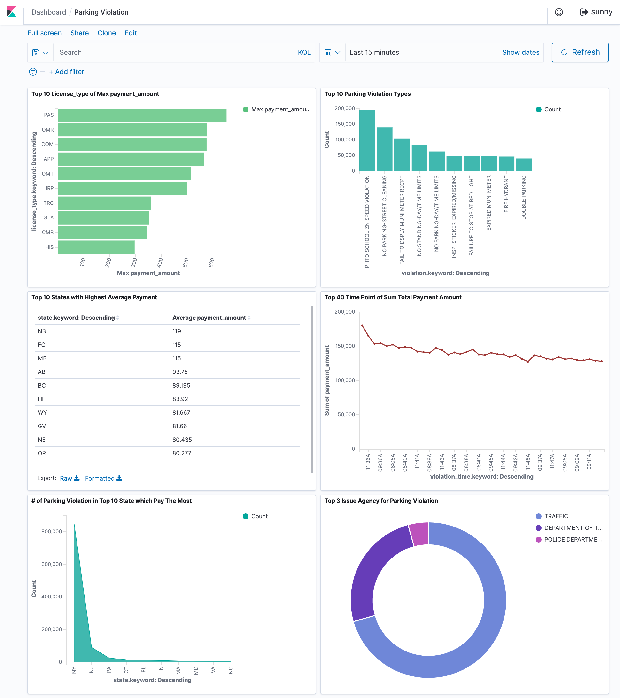

## Project: Analyzing Millions of NYC Parking Violations Context

NYC agencies and other partners have published the freely available data of parking violations since January 2016. In order to better understanding the data, I created a dashboard with a few visualizations on Elastic search.

**Code**

All the python code is in the file src -> main.py

**Build the docker image**

docker build -t bigdata1:1.0 .
Requirement of information to run the code:
Dataid
APP_TOKEN es_host es_username es_password page_size num_pages(optional)

**Running the docker image**

docker run -v ${PWD}:/app --network="host" -e dataid=" dataid " -e APP_TOKEN=" APP_TOKEN " -e es_host=" es_host " -e es_username=" es_username " -e
es_password=" es_password " bigdata1:1.0 --page_size= page_size --num_pages= num_pages

This will load parking dock data into Elastic Search at a cadence of once / 30s.

**Dashboard**

